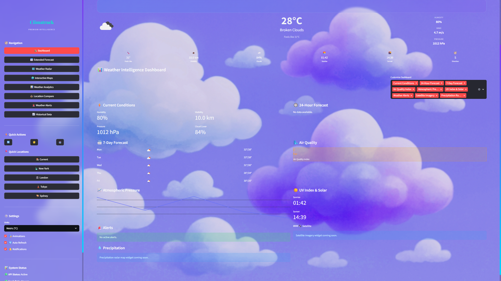
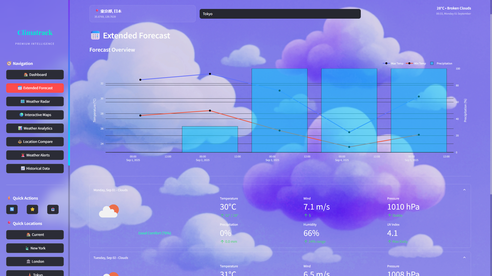
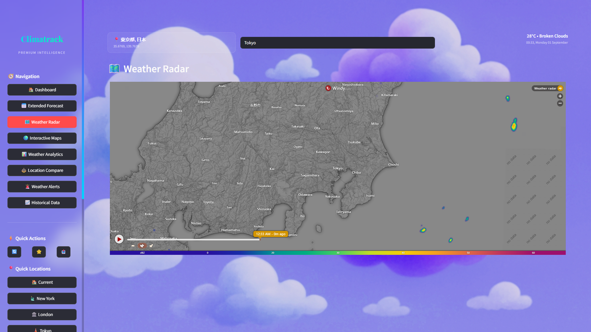
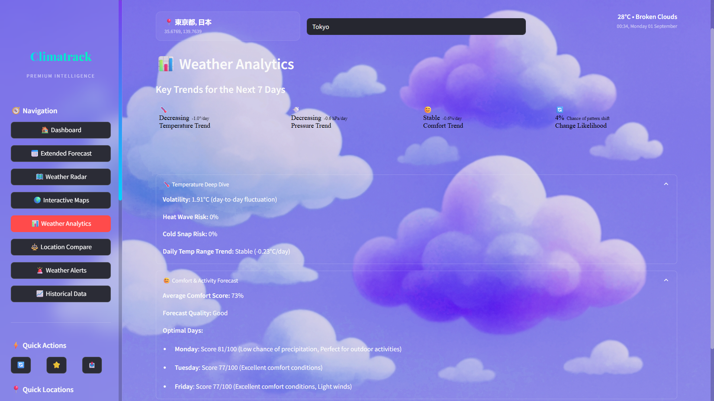
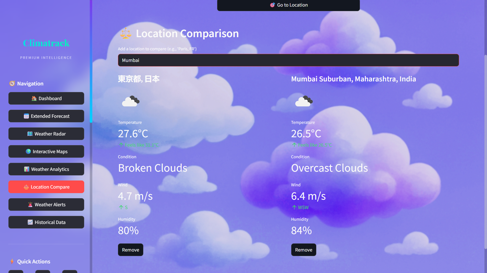

  <div align="center">
    
  </div>

<div align="center"></div>

# <div align="center">CLIMATRACK</div>

  <div align="center">
    
  </div>

## 🌦️ Your AI-Powered Weather Intelligence Platform

**Climatrack** is a world-class, AI-powered weather intelligence platform built with **Python** and **Streamlit**. It offers a rich, interactive user interface for accessing real-time global weather data, advanced analytics, and premium visualisations, moving beyond simple forecasts to provide deep, actionable insights.

---

### Vision: Beyond the Forecast, Towards True Insight

Standard weather apps provide data; Climatrack provides intelligence. In a world where weather patterns are increasingly volatile, access to simple forecasts is no longer enough. Individuals and businesses need to understand the *context* behind the numbers—the trends, the risks, and the potential impact on daily life and operations.

The vision for Climatrack is to bridge the gap between raw weather data and actionable intelligence. We believe that everyone deserves access to high-fidelity meteorological insights presented through an intuitive and beautiful interface. Climatrack is more than just a weather app; it's a sophisticated data analysis and visualization tool designed to empower decision-making.

## 🚀 Live Demo

Experience Climatrack live here: 
👉 [](https://Climatrack.streamlit.app/)

 <div align="center">
 <p>

[](https://github.com/ellerbrock/open-source-badges/)


 </p>
 </div>

<div align="center">
  
  <br>
</div>

## ✨ Features

<div align="center">
  
</div>

### 📊 Core Weather Views & Dashboard

* **Dynamic Dashboard**: A fully customisable, widget-based dashboard that provides a comprehensive overview of current conditions. Users can add, remove, and rearrange widgets to suit their needs.

<div align="center">
  
  <br>
</div>

* **Extended Forecast**: A detailed 7-day forecast with interactive Plotly charts showing temperature trends and precipitation chances, alongside daily breakdown cards for in-depth analysis.

<div align="center">
  
  <br>
</div>

* **Interactive Maps & Radar**: An embedded live weather radar for tracking precipitation and an interactive map viewer with multiple layers (temperature, wind, clouds, etc.).

<div align="center">
  
  <br>
</div>

* **Historical Data**: The ability to look up weather conditions for any past date, complete with a summary of temperature, conditions, and wind.

<div align="center">
    <br>
</div>

### 🧠 AI-Powered Analytics & Insights

* **Advanced Analytics Page**: An AI-driven analysis of the 7-day forecast that identifies key trends in temperature, pressure, and comfort levels. It also calculates a "Weather Change Likelihood" to predict pattern shifts.

<div align="center">
  
  <br>
</div>

* **Deep Dive Analysis**: Detailed expander sections provide insights into temperature volatility, heat wave/cold snap risks, and daily temperature range trends.
* **Comfort & Activity Forecast**: A unique feature that calculates a proprietary "Comfort Score" and identifies the most optimal days for outdoor activities based on a combination of weather factors.

<div align="center">
    <br>
</div>

### ⚙️ Premium Functionality

* **Location Comparison**: A side-by-side view to compare real-time weather conditions for multiple user-selected locations.

<div align="center">
  
  <br>
</div>

* **Real-time Weather Alerts**: Fetches and displays official weather alerts for a given location, classified by severity and including actionable recommendations.
* **AI-Enhanced Geocoding**: A smart search system that can handle location names, coordinates, and points of interest. It uses multiple providers and AI-based scoring to deliver the most accurate results.

---

## 🧩 Architecture & Modularity

The application is cleanly architected into distinct, single-responsibility modules, making it scalable and easy to maintain:
* `main.py`: The main application entry point. Contains the `PremiumWeatherApp` class which controls the UI and application flow.
* `weather_api.py`: The `PremiumWeatherAPI` class manages all communication with the OpenWeatherMap API, including advanced features like caching, rate limiting, and data validation.
* `location_detector.py`: The `PremiumLocationDetector` class handles all geocoding and IP-based location lookups, using AI-enhancements to improve accuracy.
* `data_processor.py`: The `AdvancedDataProcessor` class is the analytics engine. It takes raw API data and transforms it into the advanced trends, scores, and insights seen in the app.
* `ui_components.py`: The `UIComponents` class is a library of custom-styled HTML and CSS components, ensuring a consistent and premium look and feel across the application.

## 📺 Video Explanation

For a detailed walkthrough of Climatrack's features and how to use them, check out this video:

**[Video Coming Soon]**

---

## 🛠️ Technologies Used


---

## ⚙️ Installation and Setup

> Clone and run locally using Python and Streamlit.

1. **Clone the repository:**

   ```bash
   git clone https://github.com/eccentriccoder01/Climatrack.git
   cd Climatrack
   ```

2. **Install dependencies:**

   ```bash
   pip install -r requirements.txt
   ```

3.  **Set up API key:**
    Create a file named `secrets.toml` inside a `.streamlit` folder (`.streamlit/secrets.toml`) and add your OpenWeatherMap API key:

    ```toml
    OPENWEATHER_API_KEY = "YOUR_32_CHARACTER_API_KEY_HERE"
    ```

4. **Run the app:**

   ```bash
   streamlit run main.py
   ```

---

## Issue Creation ✴
Report bugs and  issues or propose improvements through our GitHub repository.

## Contribution Guidelines 📑

<div align="center">
  
</div>

- Firstly Star(⭐) the Repository
- Fork the Repository and create a new branch for any updates/changes/issue you are working on.
- Start Coding and do changes.
- Commit your changes
- Create a Pull Request which will be reviewed and suggestions would be added to improve it.
- Add Screenshots and updated website links to help us understand what changes is all about.

- Check the [CONTRIBUTING.md](CONTRIBUTING.md) for detailed steps...
    
## Contributing is fun🧡

We welcome all contributions and suggestions!
Whether it's a new feature, design improvement, or a bug fix — your voice matters 💜

Your insights are invaluable to us. Reach out to us team for any inquiries, feedback, or concerns.

## 📄 License

This project is open-source and available under the [MIT License](LICENSE).

## 📞 Contact

Developed by [Eccentric Explorer](https://eccentriccoder01.github.io/Me)

Feel free to reach out with any questions or feedback\! Thanks for reading, here's a cookiepookie:

